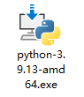
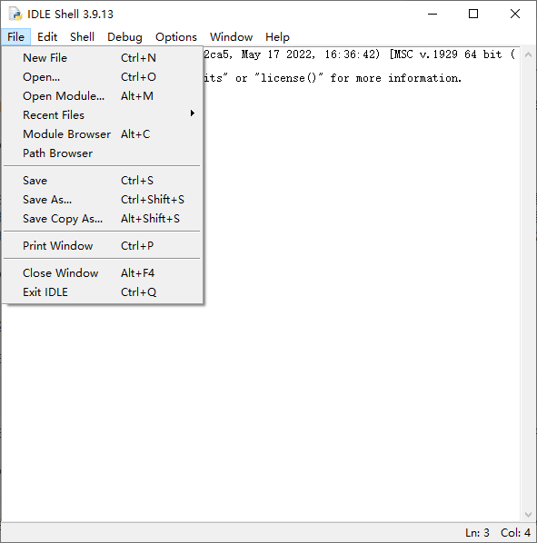

# 1 Python启蒙

# 1.1 Python是什么

Python是一个编程语言，因为简单易学和强大的功能而被广泛使用，处处都有它的踪影。

Python现在常用的版本有2.x和3.x，不过Python现在广泛推广3.x，一些2.x的代码需要修改才能在3.x运行，这个教程会学习Python3的内容。

# 1.2 安装Python

作者懒得写安装过程了，自行上网搜索，附上[Python 官网](https://www.python.org)。

例如在官网找安装程序进行安装。

如果不想安装 Python 的话，可以在网上找一些 Python在线编程 的网站，不过会有很多的功能限制。

# 1.3 使用IDLE编写程序

在开始菜单里找到 IDLE (Python 3.x) 打开，这是Python自带的代码编辑器，打开的第一个窗口是交互式窗口，在提示符">>>"后输入代码按回车，可以直接看到结果。点击菜单栏里的 File --> New File 或按键盘 Ctrl + N 打开代码编辑窗口，可以在这里输入代码编写程序。写好程序后，点击 File --> Save 或按键盘 Ctrl + S 保存文件。在菜单中点击 Run --> Run Module 或按下键盘 F5 运行程序。点击 File --> Open 或按 Ctrl + O 就可以打开文件。



# 1.4 输出 Hello World

令人心动的时刻来了，显示一个 Helo World ！！！

在Python中，打印函数`print()`可以在屏幕上输出文字。

```python
print("Hello World") 
```

在这段代码中`print()`是一个输出用的函数。被它用括号抱起来的`"Hello World"`是一个字符串，字符串就是一串文字，用两个`"`把它们穿起来就行。

Python中，一行就是一个步骤，Python会从上到下运行你的一个个步骤。

# 1.5 注释

注释是一段提示，可以用注释告诉别人你的代码是干什么用的。Python解释器(运行Python代码的软件)不会识别你的注释。

### 单行注释

在一行代码的末尾加上"#"(井号)，这行"#"后面的内容就都是注释。

```python
print("Hello World")     #显示 Hello World
#我是单行注释
```

### 多行注释

用三个单引号或双引号为一边括起来的，是多行注释。

```python
"""
我是多行注释
人生苦短 我选Python
Hello World
"""
print("Hello World")
"""多行注释也可以在一行内"""
```

# 1.6 变量

变量，一个会变化的量，是程序中一个重要的东西，它可以储存数据。在Python中，一个变量可以直接赋值使用。

```python
apples = 5   #把变量apples赋值数字5，代表苹果有5个
```

变量要清晰明了，最好能让别人明白这个变量的用途。

变量只能是英文字母、数字、下划线"_"组成，只能以英文字母开头，变量名不能是一个函数，大小写不同就是两个变量。

|变量名|是否合法|变量名|是否合法|
|--|--|--|--|
|a4|合法|1j=-+3|不合法 不能有符合|
|f|合法|8u|不合法 不能数字开头|
|d56d|合法|print|不合法 print是函数/关键词|

```python
apples = 5                      #苹果有5个
print("苹果有",apples,"个")     #输出苹果的数量，在print()中，可以用英文逗号分开几个量。
```

运行结果如下

```python
苹果有 5 个
```

# 1.7 输入函数input()

一个程序，只有输出，没有输入，那么它能做的事情就很少。在Python中，input()函数能实现输入。

```python
name = input("请输入您的姓名：")     #input()询问用户名称，在把字符串回答传给变量name
print(name,"很高兴认识你")           #print()先说出用户的名称，再问好
```

运行结果如下

```python
请输入您的姓名：GengCR
GengCR 很高兴认识你
```

在运行之后，程序询问姓名，回答`GengCR`并按`Enter回车`后程序就来问好了。

# 1.8 运算符

在Python中，也有加减乘除。打开交互式窗口试试吧。

- 加法  ==+==
- 减法 ==-==
- 乘法 ==*==
- 除法 ==/==
- 求余数 ==%==
- 次方 ==**==
- 取整除法 ==//==

```python
>>> 1 + 1
2
>>> 8 - 5
3
>>> 4 * 7
28
>>> 42 / 7
6.0
>>>  18 % 4
2
>>> 5 ** 3
125
>>>  18 // 4
4
```

当然，我们也可以把他写成一个程序。

```python
a = 35
b = 7
print("35 + 7 =" , a + b)
print("35 - 7 =" , a - b)
# 就写两个例子，其他自己写！
```

运行结果如下

```python
35 + 7 = 42
35 - 7 = 28
```
