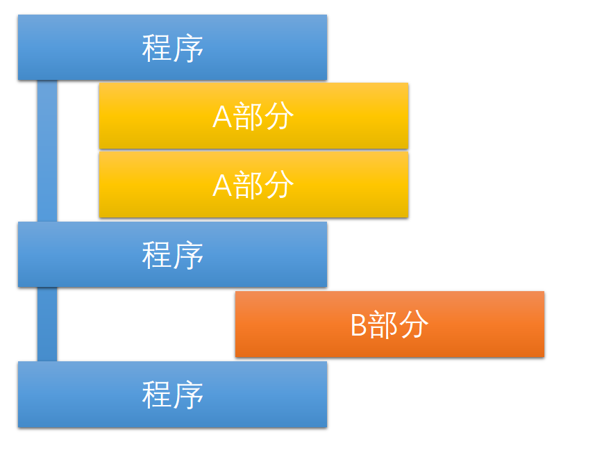
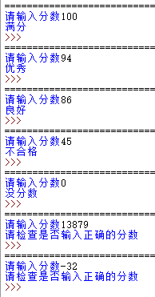
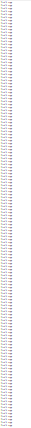

# 2 判断与循环

# 缩进

缩进是Python中一种重要的形式，用来区分层次，通常以四个空格的形式存在。

```python
key = input("请输入密码：")
if key == "666789":
    print("密码正确")
    print("欢迎使用")
else:
  print("密码错误")
```

如上面这段代码，是一个使用if判断语句的代码，几个print()前面都有空格，这就是缩进，一个层次统一比上一层多N个空格。一层缩进由上一行代码末尾的冒号开始。

<br/>



# if 判断语句

说到判断，就需要认识一种Python中的量的类型——布偶型Bool

True 真          False 假         ( 注意要大写 )

```python
if True或False:       #必须
    如果True就要执行这里
elif True或False:     #选择性
    如果第一次False第二次True就执行这里
elif True或False:     #选择性
    如果前面都False这次True就执行这里
#...    选择性
else:                 #选择性
    如果都False就执行这里
```

上面是一个if语句大纲，if、elif、else这些层次平齐，执行的代码都要缩进。

### 判断符

|符号|作用|符号|作用|
|--|--|--|--|
|==|等于 =|>|大于 >|
|!=|不等于 ≠|<|小于 <|
|>=|大于等于 ≥|<=|小于等于 ≤|

在交互式窗口里试试

```python
>>> 4 + 9 == 13
True
>>> 8 + 8 > 23
False
...
```

也可以写进程序，放进if语句。

```python
a = 8
b = "8"
if a == b:
  print("一样")
else:
  print("不一样")
```

结果当然是不一样，因为a是数字(整数类型)，而b是字符串。

用if做一个分数等级判断器，看看考了优良还是合格。

100 满分    90 优秀    80 良好    60 合格    1 不合格    0 没分数

```python
a = int( input("请输入分数:") )   # int() 可以把其他类型转换成整数类型，因为字符串不能进行比较
if a > 100 or a < 0:             # 先挑出错误的分数
  print("请检查是否输入正确的分数")
elif a == 100:
  print("满分")
elif a >= 90:
  print("优秀")
elif a >= 80:
  print("良好")
elif a >= 60:
  print("合格")
elif a >= 1:
  print("不合格")
elif a == 0:
  print("没分数")
```



# or , and , not

or 是或，只要两边有一边是真的，就会变成真。

```python
>>> 1 == 4 or "6" == "6"
True
>>> True or False
True
>>> True or True
True
```

and 是与，只要两边都是真的，就会变成真的。

```python
>>> False and True
False
>>> False and False
False
>> True and True
True

```

not 是否，它可以把一个值反过来。

```python
>>> not False
True
>>> not True
False
```

# for 循环语句

假如有一个程序，要求输出一千遍遍同样的文字，那这么多个print()要打到什么时候，用复制粘贴也可能打多打少*==(看行数Doge)==*，这时候，就要用到循环。

如果你知道你要循环几遍，就可以用 for 循环语句，更加方便。

```
for i in range(1000):
    print("Don't copy")
```

运行结果，看不清别怪我：

在 range() 里，填上要循环的次数，变量 i 就是目前循环了几次，i 会从 0 到 1000之前(999)。

如果range()里写的在详细一些，也一样。

```python
range(20)       #         到20之前
range(0,20)     # 从0     到20之前
range(0,1,20)   # 从0间隔1到20之前 
```

变量 i 同样可以修改为其他变量，如a\b\c\d...。

for循环可以一层套一层。

# while 循环语句

while 也是一种循环语句，与for不同的是，它更适合不知道要循环几次的地方。

```python
while i < 8:
  print("hello")
  i += 1    # i += 1 同等与 i = i + 1
```

while的工作原理是：如果后面的值为真，开始循环，每循环完一次，又会去判断，如果为真，就继续下一轮循环，如果为假，就退出循环。

while循环可以一层套一层。

# break 语句

在循环中，经常能看到break语句，它的作用就是跳出循环。无论在什么地方，break都能跳出一层循环，这个循环可能是for，也可能是while。

```python
for i in range(10):
  print(i)
  if i == 7:
    break
```

上面这些代码，执行结果如下。for循环从0开始，到7的时候，被break跳出了循环。

```python
0
1
2
3
4
5
6
7
```

# continue 语句

continue 语句也出现在循环当中，它的作用就是跳过本次循环。当循环遇到continue的时候，for循环会直接进行下一次，如果已经是最后一次，就会正常跳出循环，而while遇到continue时，会跳过循环后面的语句，再次判断，真就新一次循环，假就跳出循环。

```python
for i in "Pyxxthxxon":  # 让i遍历"Pyxxthxxon"的每一个字符
    if i == "x":        #检测"x"
        continue        #如果是"x"就跳过
    print(i,end="")     #输出i，end=""是将print()输出末尾不换行。
```

这一段代码会输出Python，因为跳过了x。

# for...else 和 while...else 语句

如果一个for循环或while循环不是通过break跳出的，也就是正常执行完的，就会执行后面的else语句。

```python
for i in range(6):
  if i == 3:
    break
else:
  print("我不会被执行，因为这个for循环到3的时候用break跳出来了")

print("-------------")

i = 0
while i < 6:
  i += 1
else:
  print("我会被执行，因为这个while循环没有被break跳出")
```

执行结果

```python
-------------
我会被执行，因为这个while循环没有被break跳出
```

# pass 空语句

pass是一个空语句，它什么都不干，就是占位用的，可以保证程序的结构完整性。

```python
a = 666
if a != 666:
  pass         #这行是空语句，占位用的
else:
  print("Yes")
```